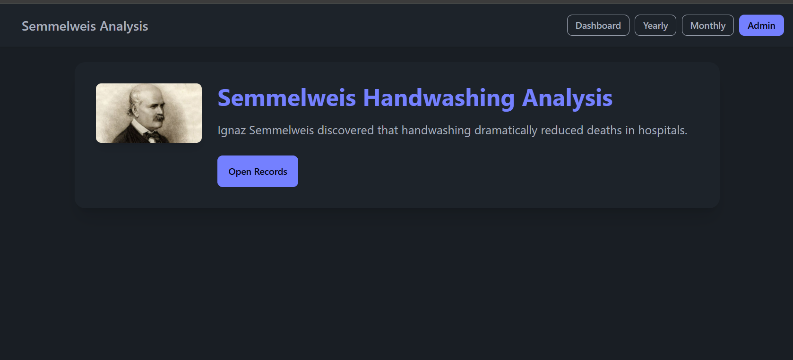
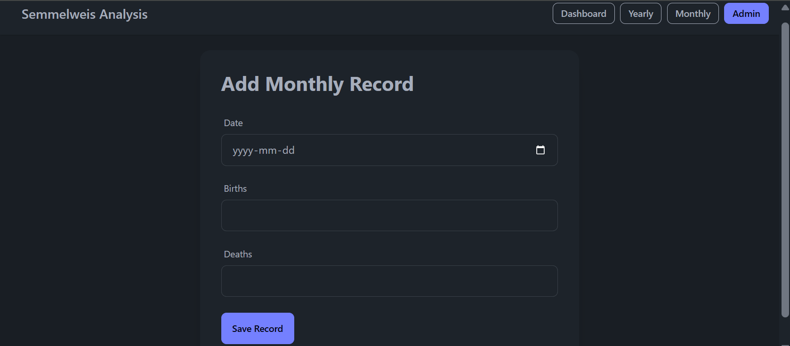
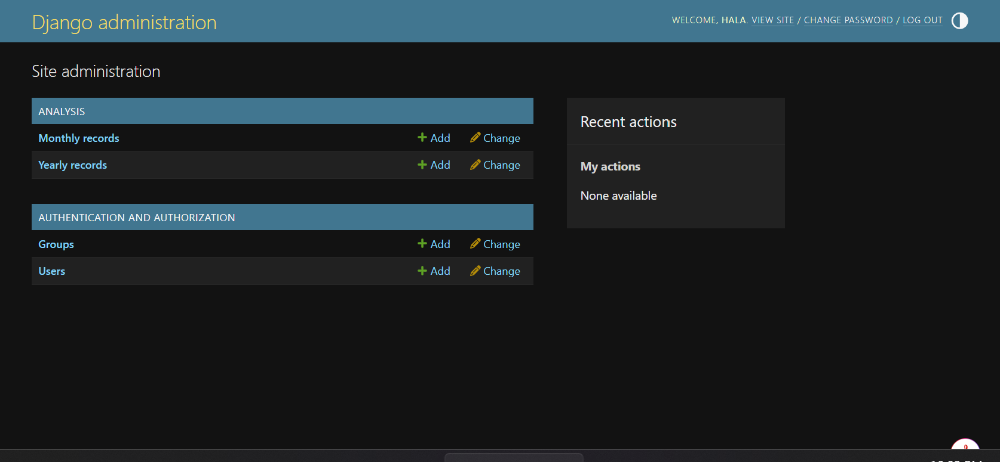
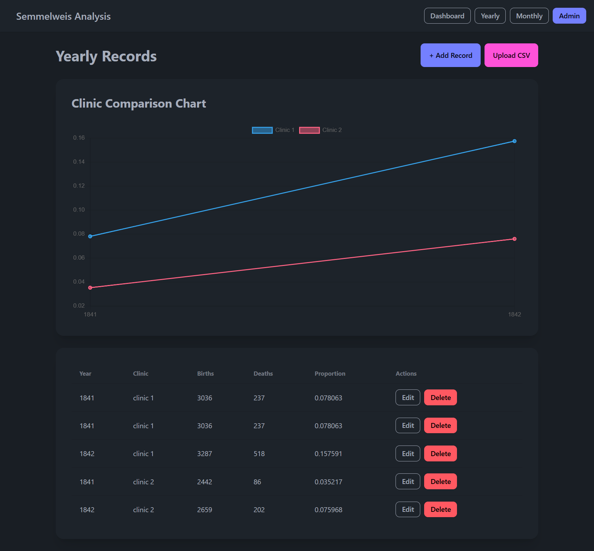
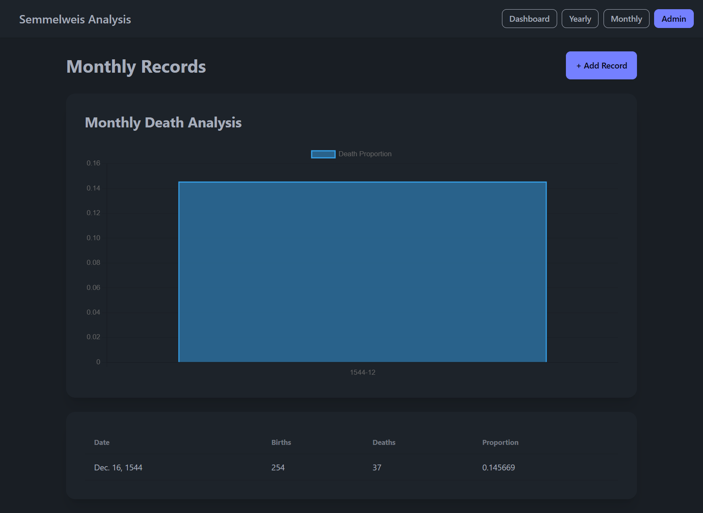

# 🏥 Semmelweis Analysis System

A professional Django-based data analysis web application for managing and visualizing yearly and monthly clinic records.

---

## 🚀 Features

This project demonstrates:

- Full CRUD operations (Create, Read, Update, Delete)
- Data visualization using Chart.js
- CSV file upload and processing with Pandas
- Service-layer architecture
- Clean UI using Tailwind CSS + DaisyUI
- Separation of concerns (Models, Views, Forms, Services)

---

## 📸 Project Screenshots

### 🏠 Dashboard
Main landing page of the system.

---

### ➕ Add Record
Used to create new yearly records.

---

### 🔐 Admin Panel
Django admin interface for managing database records.

---

### 🗂 Yearly Records List
Displays all yearly records in a structured table with:
Year, Clinic, Births, Deaths, Proportion of deaths, Edit & Delete actions.

---

### 📊 Monthly Records Page
Displays monthly analysis with chart visualization.

---

### 📤 Upload CSV Page
Allows users to upload CSV files for bulk data import.

The system:
- Reads CSV using Pandas  
- Processes and validates data  
- Saves to database  
- Automatically updates charts  

![Upload CSV]

---

## 🏗 System Architecture

Follows Django best practices:

- **Models** → Define database structure  
- **Forms** → Handle validation and input  
- **Views** → Control application logic  
- **Services** → Handle CSV processing & business logic  
- **Templates** → UI rendering with inheritance  
- **Static Files** → Charts and styling assets  

---

## 📊 Data Visualization

Using **Chart.js**, the system provides:

- Yearly clinic comparisons  
- Death proportion analysis  
- Monthly trend visualization  
- Dynamic chart updates after data changes  

---

## 📁 Project Structure
